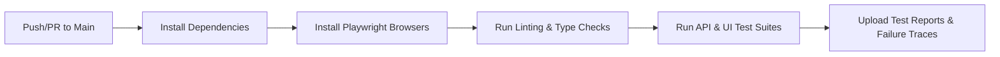

# 🚀 Team Onboarding Guide


Welcome to the Enterprise Playwright Automation Framework. This guide will get you productive within your first day.

## Table of Contents
- [Prerequisites](#prerequisites)
- [Environment Setup](#environment-setup)
- [Project Architecture](#project-architecture)
- [How to Write Your First Test](#how-to-write-your-first-test)
- [How to Add a New Page Object](#how-to-add-a-new-page-object)
- [How to Add a New API Client](#how-to-add-a-new-api-client)
- [Test Tagging Strategy](#test-tagging-strategy)
- [Coding Conventions](#coding-conventions)
- [Running Tests](#running-tests)
- [Debugging Failing Tests](#debugging-failing-tests)
- [CI/CD Pipeline](#cicd-pipeline)
- [PR Review Checklist](#pr-review-checklist)
- [Common Pitfalls](#common-pitfalls)

---

## Prerequisites

| Tool | Version | Installation |
|---|---|---|
| Node.js | LTS (≥18.x) | [nodejs.org](https://nodejs.org/) |
| Git | Latest | [git-scm.com](https://git-scm.com/) |
| VS Code | Latest | [code.visualstudio.com](https://code.visualstudio.com/) |
| Playwright Extension | Latest | VS Code Extensions Marketplace |

### Recommended VS Code Extensions
- **Playwright Test for VSCode** — Run/debug tests from the editor
- **ESLint** — Lint errors inline
- **Prettier** — Auto-format on save
- **GitLens** — Blame annotations and history

---

## Environment Setup

```bash
# 1. Clone the repository
git clone <repo-url>
cd assignment

# 2. Install dependencies
npm install

# 3. Install Playwright browsers
npx playwright install --with-deps

# 4. Create your local environment file
cp config/env/.env.example config/env/.env.qa
# Edit .env.qa with your credentials (never commit this file)

# 5. Verify setup — run a smoke test
npm run test:smoke
```

### Environment Variables

| Variable | Description | Default |
|---|---|---|
| `BASE_URL` | SauceDemo web app URL | `https://www.saucedemo.com/` |
| `API_URL` | Restful-Booker API base URL | `https://restful-booker.herokuapp.com` |
| `API_USER` | API authentication username | (set in .env.qa) |
| `API_PASS` | API authentication password | (set in .env.qa) |
| `UI_USER` | Web app login username | (set in .env.qa) |
| `UI_PASS` | Web app login password | (set in .env.qa) |
| `LOG_LEVEL` | Logging verbosity | `info` |

---

## Project Architecture

```
├── .github/workflows/       # CI/CD Pipeline (GitHub Actions)
├── config/
│   ├── env.config.ts         # Environment configuration loader
│   └── env/
│       ├── .env.example      # Template for environment variables
│       └── .env.qa           # QA environment values (git-ignored)
├── src/
│   ├── core/                 # Base abstractions
│   │   ├── BasePage.ts       # Base class for all Page Objects
│   │   ├── RequestWrapper.ts # HTTP client wrapper with logging
│   │   ├── Logger.ts         # Winston-based structured logging
│   │   └── RedactionHelper.ts# Sensitive data masking
│   ├── pages/                # Page Object Model classes
│   │   ├── LoginPage.ts
│   │   ├── InventoryPage.ts
│   │   ├── CartPage.ts
│   │   └── CheckoutPage.ts
│   ├── api/                  # API client layer
│   │   ├── BookingClient.ts  # Restful-Booker API client
│   │   ├── TokenManager.ts   # Auth token caching with TTL
│   │   └── request-builders/ # Builder pattern for payloads
│   │       └── BookingBuilder.ts
│   ├── schemas/              # Zod validation schemas + types
│   │   └── booking.schemas.ts
│   ├── fixtures/             # Playwright custom fixtures (DI)
│   │   ├── ui.fixtures.ts    # Page Object injection
│   │   └── api.fixtures.ts   # API client injection
│   └── constants/            # Centralized selectors & constants
│       └── selectors.ts
├── tests/
│   ├── setup/                # Authentication setup project
│   │   └── auth.setup.ts
│   ├── ui/                   # Web UI test specs
│   │   ├── login.spec.ts
│   │   ├── catalog.spec.ts
│   │   ├── cart.spec.ts
│   │   ├── checkout.spec.ts
│   │   └── e2e-flow.spec.ts
│   └── api/                  # API test specs
│       ├── auth.spec.ts
│       ├── booking.spec.ts
│       └── e2e-booking-flow.spec.ts
├── playwright.config.ts      # Playwright configuration
├── tsconfig.json             # TypeScript configuration
├── eslint.config.js          # ESLint rules
└── .prettierrc               # Prettier formatting rules
```

### Key Design Decisions

| Decision | Rationale |
|---|---|
| **Fixtures over `beforeEach`** | Lazy initialization, test independence, efficient worker utilization |
| **BasePage abstraction** | Centralized logging, smart waits, single point of change for Playwright API updates |
| **Zod schema validation** | Contract testing for APIs — catches breaking changes beyond status codes |
| **Builder pattern** | Fluent, readable test data creation with sensible defaults |
| **Centralized selectors** | Single source of truth — UI changes require updates in one place |
| **Winston logging** | Structured, leveled logging with file persistence for debugging |
| **Credential redaction** | Enterprise security — no secrets in logs |

---

## How to Write Your First Test

### UI Test Example

```typescript
// tests/ui/my-feature.spec.ts
import { test, expect } from '@fixtures/ui.fixtures';

test.describe('My Feature Module @regression', () => {
  test('should do something positive @smoke', async ({ inventoryPage, page }) => {
    await page.goto('/inventory.html');
    // Use page object methods — never use raw selectors in tests
    await inventoryPage.addProductToCart('Sauce Labs Backpack');
    expect(await inventoryPage.getCartBadgeCount()).toBe('1');
  });

  test('should handle negative case', async ({ page }) => {
    // Negative test logic
  });
});
```

### API Test Example

```typescript
// tests/api/my-api.spec.ts
import { test, expect } from '@fixtures/api.fixtures';
import { BookingBuilder } from '@api/request-builders/BookingBuilder';
import { BookingSchema } from '@schemas/booking.schemas';

test.describe('My API Tests @regression', () => {
  test('should create a resource @smoke', async ({ bookingClient }) => {
    const payload = new BookingBuilder().withFirstName('Test').build();
    const response = await bookingClient.createBooking(payload);
    
    expect(response.status()).toBe(200);
    const body = await response.json();
    expect(BookingSchema.safeParse(body.booking).success).toBe(true);
  });
});
```

### Rules for Writing Tests
1. **Never use raw selectors in tests** — always go through page objects
2. **Always tag tests** with `@smoke`, `@regression`, or `@e2e`
3. **One assertion concept per test** — multiple related asserts are fine, but don't test multiple features
4. **Use descriptive test names** — `should <expected behavior> when <condition>`
5. **Use the Builder pattern** for API payloads — never inline raw JSON objects
6. **Validate schemas** for all API responses, not just status codes

---

## How to Add a New Page Object

1. **Create the page class** in `src/pages/NewPage.ts`:
```typescript
import { Page, Locator } from '@playwright/test';
import { BasePage } from '@core/BasePage';
import { SELECTORS } from '../constants/selectors';

export class NewPage extends BasePage {
  private readonly myElement: Locator;

  constructor(page: Page) {
    super(page);
    this.myElement = page.locator(SELECTORS.NEW_PAGE.MY_ELEMENT);
  }

  async doSomething() {
    await this.click(this.myElement, 'My Element');
  }
}
```

2. **Add selectors** to `src/constants/selectors.ts`:
```typescript
NEW_PAGE: {
  MY_ELEMENT: '[data-test="my-element"]',
},
```

3. **Register in fixtures** (`src/fixtures/ui.fixtures.ts`):
```typescript
import { NewPage } from '@pages/NewPage';

type UIWorkspaces = {
  // ... existing pages
  newPage: NewPage;
};

export const test = base.extend<UIWorkspaces>({
  // ... existing fixtures
  newPage: async ({ page }, use) => {
    await use(new NewPage(page));
  },
});
```

4. **Write tests** in `tests/ui/new-page.spec.ts`.

---

## How to Add a New API Client

1. **Define Zod schemas** in `src/schemas/` for response validation
2. **Create a Builder** in `src/api/request-builders/` for request payloads
3. **Create the Client** in `src/api/` extending `RequestWrapper`
4. **Register in fixtures** (`src/fixtures/api.fixtures.ts`)
5. **Write tests** in `tests/api/`

---

## Test Tagging Strategy

| Tag | Purpose | When to Run | Approx. Count |
|---|---|---|---|
| `@smoke` | Critical path validation | Every PR, every deploy | ~10 tests |
| `@regression` | Full feature coverage | Nightly, release candidate | All tests |
| `@e2e` | End-to-end user journeys | Pre-release validation | ~5 tests |
| `@api` | API-only tests | API changes, backend deploys | ~15 tests |
| `@ui` | UI-only tests | Frontend changes | ~15 tests |

### Running by Tag
```bash
npm run test:smoke          # @smoke tests only
npx playwright test --grep @regression
npx playwright test --grep @e2e
npx playwright test --grep @api
```

---

## Coding Conventions

### Naming
- **Files:** `PascalCase.ts` for classes, `camelCase.ts` for utilities, `kebab-case.spec.ts` for tests
- **Test describes:** Module name (e.g., `'Login Module'`, `'Booking Management'`)
- **Test names:** Descriptive with Positive/Negative prefix (e.g., `'Positive: Create a new booking'`)
- **Page methods:** Action verbs (e.g., `addProductToCart`, `fillInformation`, `getErrorMessage`)

### TypeScript
- **No `any` types** — use `z.infer<typeof Schema>` or explicit interfaces
- **`readonly` for injected dependencies** — `constructor(private readonly page: Page)`
- **Prefer `const` over `let`** unless reassignment is necessary
- **Use path aliases** — `@core/*`, `@pages/*`, `@api/*`, `@schemas/*`, `@fixtures/*`, `@config/*`

### Testing
- **Use Playwright's auto-retrying assertions** (e.g., `await expect(locator).toBeVisible()`) over manual waits
- **Clean up test data** in `afterEach` / `afterAll` for API tests
- **Never hardcode URLs** — always use `env.API_URL` or `env.BASE_URL`

---

## Running Tests

```bash
# All tests (all browsers + API)
npm test

# UI tests only (Chromium)
npm run test:ui

# API tests only
npm run test:api

# Smoke tests
npm run test:smoke

# Specific test file
npx playwright test tests/ui/login.spec.ts

# Headed mode (see the browser)
npx playwright test --headed

# Debug mode (step through)
npx playwright test --debug

# UI Mode (interactive)
npx playwright test --ui

# Generate Allure report
npx allure generate allure-results --clean -o allure-report
npx allure open allure-report
```

---

## Debugging Failing Tests

### Step 1: Check the error message
Playwright provides detailed error messages with locator context.

### Step 2: Use trace viewer
Traces are captured on first retry. Open them:
```bash
npx playwright show-trace test-results/<test-name>/trace.zip
```

### Step 3: Check screenshots
Screenshots are captured on failure and saved in `test-results/`.

### Step 4: Run in debug mode
```bash
npx playwright test tests/ui/login.spec.ts --debug
```

### Step 5: Check logs
- Console logs: visible in terminal output
- File logs: `logs/combined.log` and `logs/error.log`

### Step 6: For flaky tests
1. Run with `--repeat-each=10` to reproduce flakiness
2. Check for timing issues — add explicit waits if needed
3. Check for test data dependencies — ensure test isolation
4. If confirmed flaky, add `test.fixme()` with a ticket reference

---

## CI/CD Pipeline

### Pipeline Flow


### What Triggers the Pipeline
- **Push** to `main` or `master` branches
- **Pull Request** targeting `main` or `master`

### Environment Variables in CI
Sensitive values are stored in **GitHub Secrets**:
- `BASE_URL`, `API_URL` — Application URLs
- `API_USER`, `API_PASS` — API credentials
- `UI_USER`, `UI_PASS` — UI credentials

### Viewing Results
1. Go to the **Actions** tab in GitHub
2. Click on the workflow run
3. Download the `playwright-report` artifact
4. Open `index.html` in a browser

---

## PR Review Checklist

Before approving a PR, verify:

- [ ] Tests follow the naming conventions
- [ ] No raw selectors in test files (use page objects)
- [ ] No `any` types (use typed interfaces or Zod inference)
- [ ] No hardcoded URLs or credentials
- [ ] Tests are tagged appropriately (`@smoke`, `@regression`)
- [ ] New page objects extend `BasePage`
- [ ] API tests validate response schemas (not just status codes)
- [ ] Test data is cleaned up in `afterEach`/`afterAll`
- [ ] No `test.only` or `test.skip` without a ticket reference
- [ ] ESLint and Prettier pass (`npm run lint && npm run format`)

---

## Common Pitfalls

| Pitfall | Solution |
|---|---|
| Tests pass locally but fail in CI | Check for `networkidle` waits, use explicit element waits instead |
| Flaky click/fill actions | Ensure `waitFor({ state: 'visible' })` — BasePage handles this |
| API tests fail with 403 | Token may have expired — `TokenManager` handles refresh automatically |
| Import path errors | Use path aliases (`@core/`, `@pages/`, etc.) defined in `tsconfig.json` |
| Tests interfere with each other | Ensure test isolation — don't share state between tests |
| Slow CI runs | Check if browser caching is configured in the workflow |
