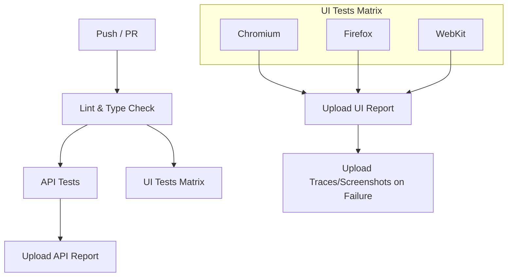

# Enterprise Playwright Automation Framework


This is a production-ready, enterprise-grade test automation framework for Web UI and API testing, built with Playwright, TypeScript, and Node.js.

## 🚀 Key Features

- **Unified Framework:** Handles both Web UI (`SauceDemo`) and API (`Restful-Booker`) testing.
- **Clean Architecture:** Implements Page Object Model (POM), Base Abstractions, and Service Layers.
- **Fixture-Based DI:** Uses Playwright Fixtures for clean dependency injection and state management.
- **Strict Typing:** Full TypeScript implementation with Zod schema validation for API contracts.
- **Parallel Execution:** Configured for high-speed parallel execution in CI/CD.
- **Enterprise Logging:** Structured logging with Winston (Console + File).
- **Advanced Reporting:** Integrated with Playwright HTML Reporter and Allure Reports.
- **CI/CD Ready:** Complete GitHub Actions workflow included.

## 📁 Project Structure

```text
├── .github/workflows/       # CI/CD Pipeline
├── config/                  # Environment and Global Constants
├── src/
│   ├── core/                # BasePage, RequestWrapper, Logger
│   ├── pages/               # UI Page Objects
│   ├── api/                 # API Clients and Request Builders
│   ├── schemas/             # Zod Validation Schemas
│   ├── fixtures/            # Custom Playwright Fixtures
│   └── utils/               # Data Generators and Helpers
├── tests/
│   ├── ui/                  # Web UI Spec Files
│   └── api/                 # API Spec Files
├── playwright.config.ts      # Framework Configuration
└── README.md                # Documentation
```

## 🛠️ Setup Instructions

1. **Clone the repository:**
   ```bash
   git clone <repo-url>
   cd assignment
   ```

2. **Install dependencies:**
   ```bash
   npm install
   ```

3. **Install Playwright browsers:**
   ```bash
   npx playwright install --with-deps
   ```

4. **Environment Configuration:**
   Create `.env.qa` (or use the provided one) in `config/env/`.

## 🏃 Execution Commands

- **Run all tests:** `npm test`
- **Run UI tests only:** `npm run test:ui`
- **Run API tests only:** `npm run test:api`
- **Run Smoke tests:** `npm run test:smoke`
- **Generate Allure Report:**
  ```bash
  npx allure generate allure-results --clean -o allure-report
  npx allure open allure-report
  ```

## 🏗️ Architecture Decisions

### 1. Fixtures over Hooks
We avoid `beforeEach` for object instantiation. Instead, we use fixtures to lazily initialize Page Objects and API clients. This ensures tests are truly independent and workers are utilized efficiently.

### 2. Base Abstractions
`BasePage` and `RequestWrapper` provide a centralized layer for logging and smart waits. This makes the framework resilient to changes in the underlying Playwright API.

### 3. Zod Schema Validation
API tests don't just check status codes; they validate the entire response body against Zod schemas. This provides "Contract Testing" capabilities and catches breaking API changes instantly.

## 🔄 CI/CD Pipeline

### Pipeline Architecture



### Jobs
| Job | Trigger | Purpose | Duration |
|---|---|---|---|
| `lint` | Push/PR | ESLint validation | ~30s |
| `test-api` | After lint | API endpoint validation | ~2min |
| `test-ui` | After lint | Cross-browser UI testing (matrix) | ~5min each |

### Artifacts
- **playwright-report**: HTML test report (retained 30 days)
- **test-results**: Screenshots, videos, traces on failure (retained 7 days)

### Secrets Configuration
Configure these in GitHub → Settings → Secrets → Actions:
- `BASE_URL`, `API_URL`, `API_USER`, `API_PASS`, `UI_USER`, `UI_PASS`

## 🧪 API Test Strategy

### Approach
Our API testing follows a **layered validation** approach:

1. **Status Code Validation** — Verify correct HTTP status codes for all scenarios
2. **Schema Validation** — Zod schemas validate response structure and types (contract testing)
3. **Data Integrity** — Verify response data matches request data
4. **Authorization** — Test authenticated vs. unauthenticated access
5. **Error Handling** — Validate proper error responses for invalid inputs

### Coverage Matrix
| Endpoint | Method | Positive | Negative | E2E |
|---|---|---|---|---|
| `/auth` | POST | ✅ Token generation | ✅ Invalid creds, missing fields, empty payload | — |
| `/booking` | GET | ✅ List bookings | — | — |
| `/booking/:id` | GET | ✅ Get by ID | ✅ Invalid ID (404) | ✅ |
| `/booking` | POST | ✅ Create booking | ✅ Invalid payload | ✅ |
| `/booking/:id` | PUT | ✅ Update booking | ✅ No auth (403), non-existent ID | ✅ |
| `/booking/:id` | DELETE | ✅ Delete booking | ✅ No auth (403), non-existent ID | ✅ |

### E2E Flow
`Create Booking → Update Booking → Verify Update (GET) → Delete Booking → Verify Deletion (404)`

## 📈 Future Scalability
- **Visual Testing:** Easily integrate Playwright's `toHaveScreenshot`.
- **Mobile:** Extend `playwright.config.ts` with mobile device projects.
- **Performance:** Integrate with `k6` or use Playwright's request interception for basic load metrics.
